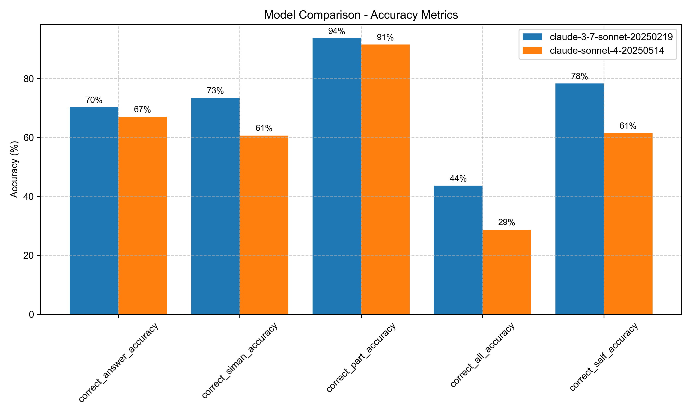
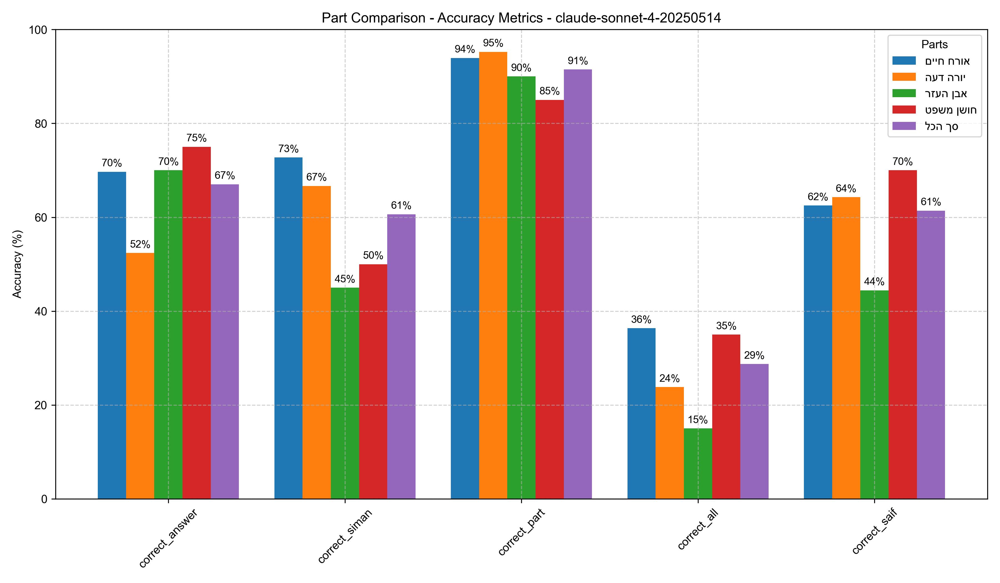

# Halacha AI Benchmark

This project evaluates the performance of an AI model (such as Claude or others) via API calls, specifically on Jewish law (Halacha) questions based on the Shulchan Aruch.

## Project Purpose
- To benchmark the accuracy of an AI model in answering Halachic questions.
- To check the correctness at multiple levels:
  - Whether the AI answered "Yes", "No" or "disagreement" correctly.
  - Whether the AI cited the correct Siman (chapter) and Saif (paragraph) from Shulchan Aruch.
  - Full correctness (answer + source match).

## How it works

### Input file (`questions.txt`)
Contains a list of Halachic questions, expected answers, and sources.

### Question Generation Process
- Questions were carefully selected from well-known and clearly defined sections across all four parts of Shulchan Aruch (33 from Orach Chaim and appoximately 20 from each of the other parts).
- Generated questions using AI models that:
  - based on the Shulchan Aruch text and Rema's.
  - designed to be clear and unambiguous.
  - structured to allow for straightforward answers.
  - story-style questions to ensure clarity and engagement.

You can find example in Example of Error Case section below.

### API calls
The project sends each question to the AI model through its API.

### Evaluation
Compares the AI's response to the ground truth:
- Answer correctness.
- Siman and Saif correctness, which Saif is checked only if the Siman is correct.

### Output files:
- `results.csv` — Detailed results for each question.
- `results.json` — Structured results.
- `results_summary.json` — Overall performance statistics.

## Project Structure
```
data/ 
  input/ 
    questions.txt # List of questions for evaluation 
  output/ 
    model-name/ # Separate directory for each model 
      results.csv # Detailed per-question results 
      results.json # JSON format of results 
      results_summary.json # Performance summary 
      comparison_plots # Visual comparisons between parts per each model
src/ 
    main.py # Main script for running the evaluation
    generate_questions.py # Script to generate questions from input sources
    utils/ # Utility functions for processing and evaluation
config.yaml # Configuration file for model parameters and API settings
```

## Key Results
We've evaluated models across all four parts of Shulchan Aruch (או"ח, יו"ד, אה"ע, חו"מ), with a total of 94 questions (approximately 20-30 questions per part):

**The average accuracy across both tested models in answering halachic questions correctly is approximately 68.62%.**

You can explore the complete results and detailed model outputs in the [output folder](https://github.com/giladmevo/halacha-ai-benchmark/tree/main/data/output).

### Model Performance Comparison
**Claude 3.7 Sonnet (February 2025)**:
- Overall accuracy: 70% correct answers
- Source citation accuracy: 73% correct Siman, 78% correct Saif

**Claude Sonnet 4 (May 2025)**:
- Overall accuracy: 67% correct answers
- Source citation accuracy: 61% correct Siman, 61% correct Saif



### Part-Specific Performance
Performance varies across different parts of Shulchan Aruch:
- **Orach Chaim (או"ח)**: Highest source citation accuracy (76%)
- **Yoreh Deah (יו"ד)**: Lowest overall accuracy (52-57%)


### Detailed Findings
- Claude 3.7 Sonnet outperforms Claude Sonnet 4 in most metrics, especially in source citation
- Siman (chapter) identification is more challenging than Saif (paragraph) identification (Saif is checked only if the Siman is correct)
- The models struggle more with Yoreh Deah questions compared to other sections
- Full correctness (correct answer + acuurate source Saif and Siman) is achieved in less than half of all cases
- Even when the models answer correctly, they frequently fail to pinpoint the exact Siman and Saif reference.

### Example of Error Case

Here's a concrete example of an incorrect model response:

- **Source**: Shulchan Aruch, Orach Chaim 8:15 states: "If his tallit falls off unintentionally, and he puts it back on, he must recite a blessing again."

- **Question posed to the model**: "My tallit fell completely to the floor unintentionally during prayer. When I picked it up and put it on again, I didn't recite a new blessing because I thought the first blessing was still valid. Did I act according to Halacha?"

- **Model's response**: The model incorrectly answered "Yes" (that the person acted correctly), directly contradicting the explicit ruling in Shulchan Aruch.

- **Analysis**: Interestingly, the model correctly identified the source in Orach Chaim section 8, but cited the wrong Se'if (paragraph 14 instead of 15), leading to the opposite ruling. Se'if 14 discusses intentionally removing the tallit, while Se'if 15 addresses unintentional falling - exactly as in the question. The model confused these distinct scenarios, resulting in incorrect guidance.

 
This example demonstrates how even when the model can locate the general area in the source material, it may still misinterpret the specific ruling or cite the wrong paragraph, leading to completely incorrect halachic guidance.

## Usage
- By default, the project runs full evaluation (including API calls).
- You can switch to analysis-only mode (without new API calls) if you already have `results.csv`.
- Results are automatically enriched with multiple accuracy checks.
- Visual comparisons between models and parts are generated.

## Notes
- Designed for flexible integration with any model that supports API calls (Anthropic Claude, OpenAI, custom models, etc.).
- Based on strict Halachic sources: only Shulchan Aruch and Rema's annotations are accepted.
- The AI model is instructed to answer shortly and to cite sources exactly.